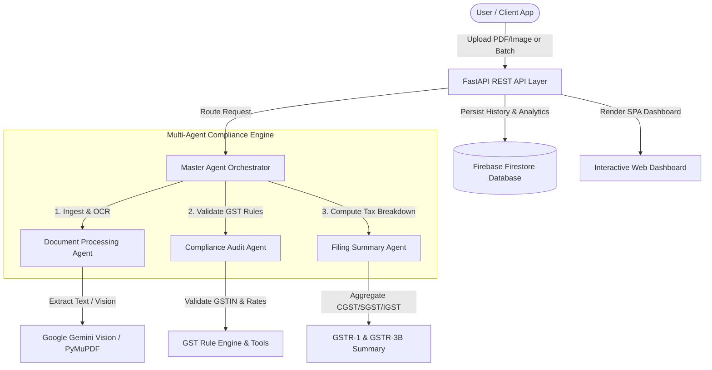

# RegFlow AI: Autonomous Regulatory Compliance & GST Filing Multi-Agent System


**RegFlow AI** is an enterprise-grade autonomous multi-agent system designed to streamline Indian Tax & Regulatory Compliance (GST). By leveraging multi-agent LLM orchestration via the **Google Agent Development Kit (ADK)** and **Gemini 2.5 Flash**, RegFlow AI automatically ingests digital & scanned invoice documents, validates GST compliance, audits tax rates, and compiles GSTR filing summaries.

---

## 🏗️ System Architecture



---

## 🌟 Key Features

- **📄 Hybrid Invoice OCR & Extraction**: Supports digital PDFs, scanned PDFs, and raw invoice images via PyMuPDF and Google Gemini Vision.
- **🤖 Autonomous Multi-Agent Pipeline**:
  - **Document Agent**: Extracts invoice metadata (Supplier, GSTIN, Line Items, Tax Amounts).
  - **Compliance Agent**: Validates GSTIN syntax/state codes, cross-checks 18%/12%/5% GST rate calculations, and flags discrepancies.
  - **Filing Agent**: Computes aggregated taxable values, CGST, SGST, IGST breakdowns, and generates GSTR-ready JSON reports.
  - **Master Agent**: Coordinates subagent tasks and enforces fallback strategies.
- **⚡ Async Batch Processing**: Processes multi-invoice ZIP files or bulk uploads asynchronously.
- **📊 Real-time Dashboard**: Interactive Single-Page Web Dashboard for invoice management, compliance status tracking, and analytics.
- **🔥 Cloud Storage & Persistence**: Integrates with Firebase Firestore for persistent compliance history and dashboard metrics.

---

## 🛠️ Technology Stack

| Layer | Technology |
| :--- | :--- |
| **AI Framework** | Google Agent Development Kit (ADK), Google GenAI SDK |
| **LLM Provider** | Google Gemini 2.5 Flash |
| **Backend API** | FastAPI, Uvicorn, Python 3.11 |
| **Document Processing** | PyMuPDF (`fitz`), Pillow (PIL) |
| **Database** | Firebase Firestore, Local JSON Fallback |
| **Frontend UI** | HTML5, Modern CSS3, JavaScript (Vanilla SPA) |
| **Containerization** | Docker, Docker Compose |

---

## 🚀 Quick Start Guide

### Prerequisites
- Python 3.11+
- Google Gemini API Key ([Get API Key](https://aistudio.google.com/))

### 1. Clone the Repository
```bash
git clone https://github.com/anuranganathan/regflow-ai.git
cd regflow-ai
```

### 2. Environment Setup
Create a `.env` file in the project root:
```bash
cp .env.example .env
```
Edit `.env` to add your Google API key:
```env
GOOGLE_API_KEY=your_gemini_api_key_here
```

### 3. Install Dependencies & Run
```bash
# Create virtual environment
python3 -m venv venv
source venv/bin/activate

# Install requirements
pip install -r requirements.txt

# Start FastAPI dev server
uvicorn app:app --reload --port 8000
```
Open your browser at `http://localhost:8000` to view the **RegFlow AI Dashboard**.

---

## 🐳 Running with Docker

Build and launch the containerized application with a single command:

```bash
# Build Docker image
docker build -t regflow-ai .

# Run Docker container
docker run -p 8000:8000 --env-file .env regflow-ai
```

---

## 📡 REST API Reference

| Endpoint | Method | Description |
| :--- | :--- | :--- |
| `GET /` | `GET` | Serves the web dashboard SPA |
| `POST /api/upload` | `POST` | Upload and process a single invoice (PDF / Image) |
| `POST /api/batch-upload` | `POST` | Process bulk invoices in a ZIP archive |
| `GET /api/dashboard` | `GET` | Fetch aggregate GST compliance analytics & stats |
| `GET /api/history` | `GET` | Retrieve past invoice processing history |

---

## 🧪 Running Unit Tests

Run the test suite to verify agent execution and tool output correctness:

```bash
# Run all unit tests
python -m unittest discover -s tests -p "test_*.py"
```

---

## 📄 License

This project is open source and available under the [MIT License](LICENSE).
